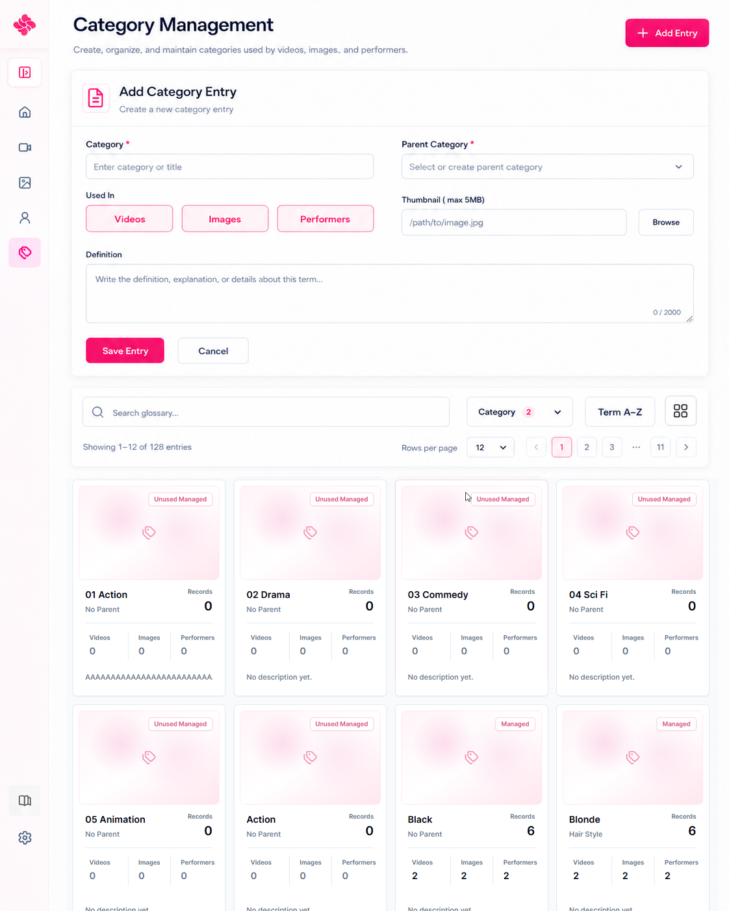
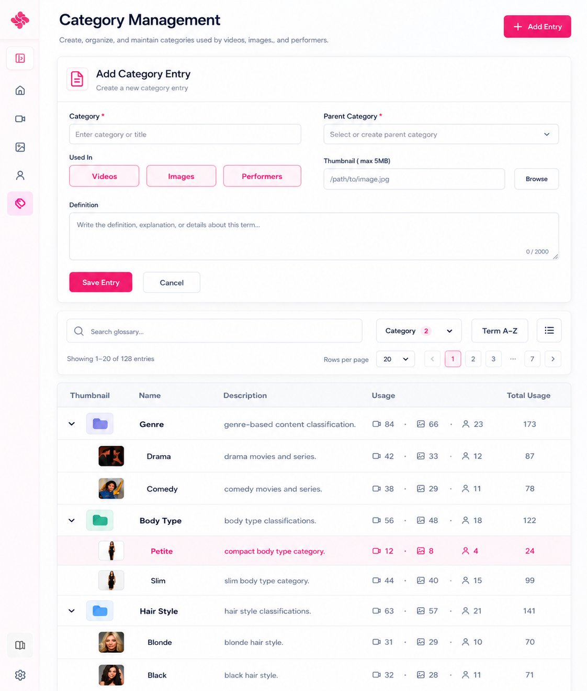

# Category Management Merge

Code: No
Layout: Yes
Mockup: Yes
Parent item: Category Management Merge (Category%20Management%20Merge%20372b4fe015dd801282c4c8d70cf2bf48.md)
Select: In progress

# Category Management — Final Layout List

## Header

- **Category Management** - Page title - Halaman untuk membuat, mengatur, dan merapikan category.
- **Subtitle** - Text - `Create, organize, and maintain categories used by videos, images, and performers.`
- **Add Entry** - Primary button - Membuka form Add Category Entry.

---

# 1. Category Form — Hidden by Default

Fungsi: Membuat, mengedit, atau menghapus category.

## Visibility

- **Default State** - Hidden - Form tidak tampil saat halaman pertama dibuka.
- **Add State** - Show - Form tampil saat user klik **Add Entry**.
- **Edit State** - Show - Form tampil saat user klik card body atau row table.
- **Delete State** - Confirm modal - Delete hanya muncul saat edit category.

## Form Header

- **Add Category Entry** - Title add mode - Membuat category baru.
- **Edit Category Entry** - Title edit mode - Mengubah category yang dipilih.
- **Helper Text** - Text - `Create a new category entry.` / `Update category details.`

## Fields

- **Category** - Text field, required - Nama category.
- **Parent Category** - Searchable select - Parent category untuk struktur category.
- **Used In** - Multi toggle button - Menentukan category tampil di halaman tertentu.
    - **Videos**
    - **Images**
    - **Performers**
- **Thumbnail** - Text field + Browse, max 5MB - Thumbnail disimpan di aplikasi.
- **Definition** - Text area - Definisi atau deskripsi category.
- **Character Counter** - Auto counter - Contoh `0 / 2000`.

## Actions

- **Save Entry** - Primary button - Simpan category baru.
- **Update Entry** - Primary button - Simpan perubahan category.
- **Delete Entry** - Danger button - Hapus category, hanya di edit mode.
- **Cancel** - Secondary button - Batalkan dan hide form.

## Behavior

- Form default hidden.
- Klik **Add Entry** → tampilkan form add.
- Klik **card body** → tampilkan form edit.
- Klik **table row** → tampilkan form edit.
- Klik **Cancel** → form collapse / hide.
- Save / Update berhasil → form hide dan list refresh.
- Delete wajib confirmation.
- Thumbnail max 5MB dan disimpan di aplikasi.
- Parent category tidak boleh circular.
- Category yang masih dipakai record tidak boleh langsung dihapus.
- Parent category yang masih punya child perlu safety step sebelum delete.

---

# 2. Toolbar

Fungsi: Search, filter, sort, view mode, dan pagination category.

## Main Toolbar

- **Search Categories** - Search field - Cari category name, parent, definition.
- **Category Filter** - Dropdown / multiple select - Filter category / scope aktif.
- **Category Count Badge** - Badge - Jumlah filter aktif.
- **Sort** - Dropdown - Term A-Z / Term Z-A / Category A-Z / Category Z-A.
- **View Toggle** - Single icon button - Switch Card / Table.
    - **Card Mode** - Default.
    - **Table Mode** - Alternatif compact table.

## Pagination Row

- **Showing Count** - Text - Contoh `Showing 1–12 of 128 entries`.
- **Rows per Page** - Dropdown - Jumlah item per halaman.
- **Pagination** - Button group - Previous / page number / next.

## Behavior

- Search update hasil secara langsung.
- Filter bisa multiple select.
- Sort berlaku untuk card dan table.
- View mode terakhir boleh disimpan jika **Remember Last View** aktif di settings.
- Card mode adalah default.
- Pagination menyesuaikan view mode.
- Saat user pindah Card/Table, filter dan pagination tetap dipertahankan.

---

# 3. Card Mode — Default View

Fungsi: Menampilkan category dalam grid card yang visual dan mudah dipindai.

## Card Content

- **Thumbnail Area** - Image / placeholder - Thumbnail category.
- **Status Badge** - Badge - Managed / Unused Managed.
- **Name** - Text - Nama category.
- **Parent** - Text - Parent category, contoh `No Parent`, `Body Type`, `Hair Style`.
- **Records** - Large number - Total usage.
- **Usage Breakdown** - Interactive link stats:
    - **Videos Count**
    - **Images Count**
    - **Performers Count**
- **Description** - Text - Definisi/deskripsi pendek.

## Card Click Zones

### Card Body — CRUD

Klik area utama card membuka edit form.

Area yang termasuk **card body**:

- thumbnail
- status badge
- name
- parent
- records total
- description
- empty area card

Behavior:

```
Click card body → Edit Category Entry
```

### Usage Count — Shortcut Navigation

Klik angka usage membuka catalog terkait dengan filter category aktif.

Behavior:

```
Click Videos 8 → Video Catalog + filter Category: selected category
Click Images 3 → Image Catalog + filter Category: selected category
Click Performers 2 → Performer Catalog + filter Category: selected category
```

## Usage Link UX

- Usage count tampil seperti statistik kecil, tapi clickable.
- Hover usage count:
    - text berubah pink
    - underline halus
    - cursor pointer
    - tooltip muncul

Tooltip contoh:

```
Open videos tagged Action
Open images tagged Petite
Open performers tagged Blonde
```

## Card Hover UX

- Hover card body → soft pink border / subtle shadow.
- Tooltip ringan: `Click to edit`.
- Selected card → soft pink background / border.
- Interactive child element memakai `stopPropagation()` agar tidak memicu edit.

## Keyboard Behavior

Saat card focused:

- **Enter** - Edit category.
- **V** - Open Video Catalog dengan category filter aktif.
- **I** - Open Image Catalog dengan category filter aktif.
- **P** - Open Performer Catalog dengan category filter aktif.
- **Esc** - Clear focus.

## Card Layout

```
[Thumbnail / Placeholder]                         [Managed]

Category Name                         Records
Parent Category                       Total number

Videos          Images          Performers
8               3               2

Description
```

## Dummy Cards

```
01 Action
Parent: No Parent
Records: 0
Videos: 0 | Images: 0 | Performers: 0
Description: No description yet.
Status: Unused Managed

Black
Parent: No Parent
Records: 6
Videos: 2 | Images: 2 | Performers: 2
Description: black hair style.
Status: Managed

Blonde
Parent: Hair Style
Records: 6
Videos: 2 | Images: 2 | Performers: 2
Description: blonde hair style.
Status: Managed

Petite
Parent: Body Type
Records: 4
Videos: 1 | Images: 1 | Performers: 2
Description: compact body type category.
Status: Managed
```

---

# 4. Table Mode

Fungsi: Menampilkan category dalam table compact untuk scanning cepat.

## Columns

- **Thumbnail** - Mini image / folder icon - Thumbnail kecil.
- **Name** - Text - Nama category.
- **Description** - Text - Definisi singkat.
- **Usage** - Inline clickable stats:
    - Video usage
    - Image usage
    - Performer usage
- **Total Usage** - Number - Total semua usage.

## Row Click Zones

### Row Body — CRUD

Klik area row utama membuka edit form.

Area yang termasuk row body:

- thumbnail
- name
- description
- total usage
- blank area row

Behavior:

```
Click row body → Edit Category Entry
```

### Usage Stats — Shortcut Navigation

Klik usage count membuka catalog terkait dengan filter category aktif.

Behavior:

```
Click video count → Video Catalog + filter Category: selected category
Click image count → Image Catalog + filter Category: selected category
Click performer count → Performer Catalog + filter Category: selected category
```

## Table Behavior

- Klik row → buka form edit.
- Row selected diberi soft pink highlight.
- Parent row bisa expand/collapse.
- Child row tampil dengan indent visual ringan.
- Usage count clickable dan tidak memicu edit.
- Tidak ada action button di row.
- Total usage hanya angka.
- Usage memakai icon kecil untuk videos, images, performers.

## Table Layout

```
Thumbnail | Name | Description | Usage | Total Usage
```

## Dummy Rows

```
Thumbnail | Name       | Description                          | Usage                    | Total
--------- | ---------- | ------------------------------------ | ------------------------ | -----
[folder]  | Genre      | genre-based content classification.  | Video 84 · Image 66 · Performer 23 | 173
[img]     | Drama      | drama movies and series.             | Video 42 · Image 33 · Performer 12 | 87
[img]     | Comedy     | comedy movies and series.            | Video 38 · Image 29 · Performer 11 | 78
[folder]  | Body Type  | body type classifications.           | Video 56 · Image 48 · Performer 18 | 122
[img]     | Petite     | compact body type category.          | Video 12 · Image 8 · Performer 4   | 24
[img]     | Slim       | slim body type category.             | Video 44 · Image 40 · Performer 15 | 99
[folder]  | Hair Style | hair style classifications.          | Video 63 · Image 57 · Performer 21 | 141
[img]     | Blonde     | blonde hair style.                   | Video 31 · Image 29 · Performer 10 | 70
[img]     | Black      | black hair style.                    | Video 32 · Image 28 · Performer 11 | 71
```

---

# 5. Shortcut Navigation Rules

Fungsi: Memastikan CRUD dan shortcut tidak bentrok.

## Core Rule

```
Card body / row body = Edit
Usage count = Open filtered catalog
```

## Interaction Priority

1. Klik usage count → navigate filtered catalog.
2. Klik card / row body → edit category.
3. Klik view toggle → switch view.
4. Klik pagination → change page.
5. Klik search/filter/sort → update list.

## Filter Target

Saat klik usage count:

- Category otomatis aktif sebagai filter.
- Catalog tujuan sesuai count yang diklik.
- Jika count `0`, link bisa tetap aktif atau disabled.

Saran:

```
Count > 0 = active link
Count = 0 = disabled / muted
```

## Back Behavior

Setelah masuk ke catalog dari usage link:

```
Category Management → click Videos 8 → Video Catalog filtered
Back → Category Management + previous scroll position
```

---

# 6. Empty State

Fungsi: Kondisi saat belum ada category.

- **Empty Title** - Text - `No categories yet.`
- **Empty Description** - Text - `Create your first category to organize videos, images, and performers.`
- **Add Entry** - Button - Membuka form add category.

---

# 7. Safety Rules

- **Delete Used Category** - Blocked / confirm step - Category yang masih dipakai record tidak bisa langsung dihapus.
- **Delete Parent Category** - Safety step - Parent yang punya child perlu memilih aksi:
    - Move children to another parent.
    - Remove parent from children.
    - Cancel.
- **Circular Parent** - Validation - Category tidak boleh menjadi parent dari dirinya sendiri atau child-nya.
- **Missing Thumbnail** - Fallback - Gunakan placeholder.
- **Thumbnail Size Limit** - Max 5MB - File thumbnail disimpan di aplikasi.

---

# 8. Footer Notice

- **Usage Notice** - Info text - `Usage counts reflect associations with videos, images, and performers.`

---

# Final Page Structure

```
Category Management
[Add Entry]

<Form hidden by default>
Show only for Add / Edit / Delete flow

Toolbar
[Search categories...] [Category + count] [Sort: Term A-Z] [View: Card/Table]

Pagination
Showing count | Rows per page | Page buttons

Card Mode — Default
Card body = edit
Usage count = open filtered catalog

Table Mode
Row body = edit
Usage count = open filtered catalog

Footer Notice
Usage counts reflect associations with videos, images, and performers.
```



