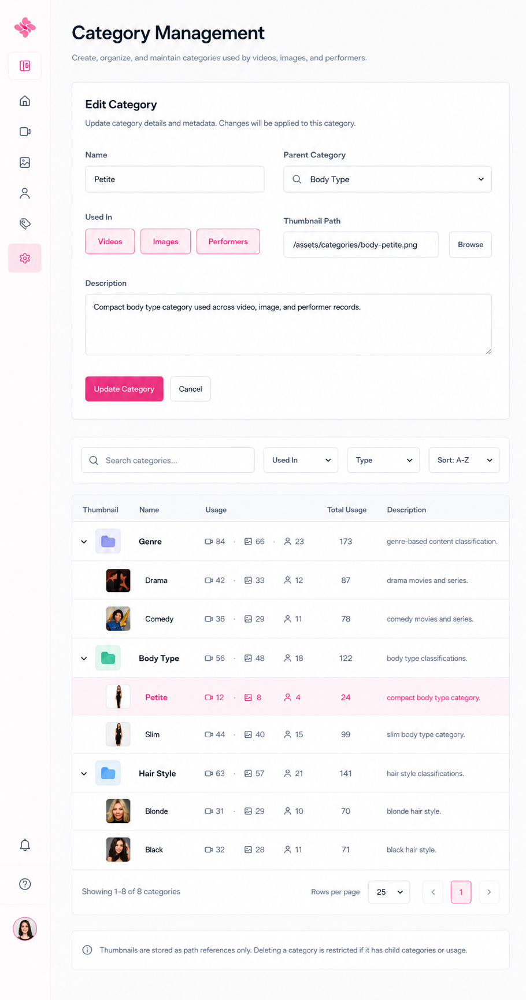

# Category management form final

Code: No
Layout: Yes
Mockup: Yes
Parent item: Final Form Spec (Final%20Form%20Spec%20370b4fe015dd80d08428c8e78f957e47.md)
Select: Revision

## **Aku ada ide baru.**

**Untuk form category & catalog category dijadikan 1**

**Karena catalog bentuk card & form bentuk table buat view mode card/list
Lalu supaya simpel form bentuknya toggel. Jadi kalau diklik button muncul,**

Form: Add / Edit Category

- **Form Mode** - Dynamic title - `Add Category` / `Edit Category`.
- **Name** - Text field, required - Nama category.
- **Parent Category** - Searchable picker - Pilih parent category, kosong berarti root.
- **Used In** - Inline toggle buttons - Pilih halaman tempat category muncul.
    - **Videos** - Toggle button - Muncul di Video Form / Catalog.
    - **Images** - Toggle button - Muncul di Image Form / Catalog.
    - **Performers** - Toggle button - Muncul di Performer Form / Catalog.
- **Thumbnail Path** - Text field + Browse - Path thumbnail. Thumbnail kecil tersimpan di aplikasi.
- **Description** - Text area - Deskripsi singkat category.
- **Update / Save Category** - Primary button - Simpan add/edit.
- **Cancel** - Secondary button - Batalkan input/edit.

## Toolbar / Filter

- **Search Categories** - Search field - Cari category berdasarkan nama.
- **Used In Filter** - Multi-checkbox dropdown - Filter Videos / Images / Performers.
- **Type Filter** - Multi-checkbox dropdown - Filter Parent / Child.
- **Sort** - Dropdown - A-Z, Z-A, Usage high-low, Usage low-high, Last updated, Last added.

## Table / Tree List

- **Thumbnail** - Small thumbnail - Folder icon untuk parent, thumbnail kecil untuk child.
- **Name** - Tree text - Nama category dengan indent child, tanpa arrow dan tanpa connector.
- **Usage** - Icon counts - Jumlah penggunaan per tipe: Video, Image, Performer.
- **Total Usage** - Number only - Total semua penggunaan.
- **Description** - Short text - Deskripsi pendek satu baris.

## Row Interaction

- **Row Click** - Edit action - Klik row langsung mengisi form.
- **Selected Row** - Soft highlight - Menandai category yang sedang diedit.
- **Parent Row** - Bold text - Root/group category.
- **Child Row** - Indented text - Subcategory, tanpa arrow/connector.
- **Delete Logic** - Restricted action - Category tidak bisa dihapus jika punya child atau masih digunakan.

## Footer

- **Result Count** - Text - Jumlah category yang tampil.
- **Rows Per Page** - Select - Jumlah row per halaman.
- **Pagination** - Buttons - Previous / Next.
- **System Note** - Info text - Thumbnail disimpan sebagai app/path reference; delete dibatasi jika punya child atau usage.

