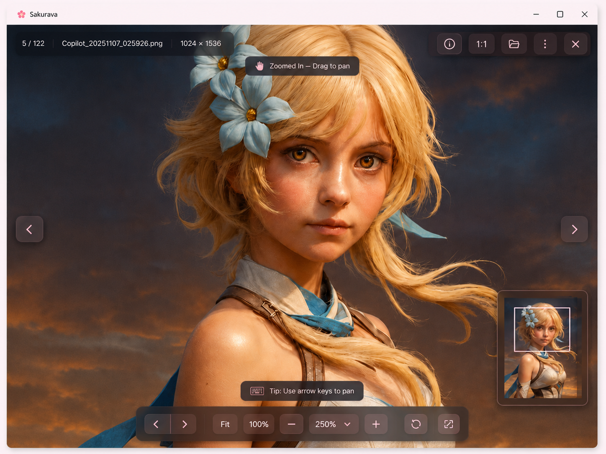

# Gallery Image Preview behavior

Code: No
Layout: Yes
Mockup: Yes
Parent item: Final Detail Spec (Final%20Detail%20Spec%20370b4fe015dd807c80d8e37b0b809cac.md)
Select: In progress

# Gallery Image Preview — Layout List

## Window Behavior

- **Gallery Image Preview** - Separate desktop window - Dibuka sebagai jendela khusus, bukan modal di dalam app utama.
- **Main App State** - Preserved - Jendela utama tetap berada di posisi terakhir.
- **Close Viewer** - Window close / top action - Menutup viewer dan kembali ke app utama.
- **Default View** - Fit to window - Gambar pertama kali dibuka dalam mode fit.

---

# 1. Viewer Canvas

Fungsi: Area utama untuk melihat gambar full size.

- **Image Canvas** - Full-window image area - Gambar memenuhi area viewer tanpa padding kosong.
- **Image Background** - Dark overlay / dimmed image edge - Membuat fokus tetap pada gambar.
- **Image Position** - Centered / pan position - Posisi gambar mengikuti zoom dan drag.
- **No Empty Spacing Rule** - Layout rule - Tidak menyisakan area kosong atas, bawah, kanan, kiri selain native window frame.

## Behavior

- Saat zoom `Fit` atau `100%`, gambar tetap berada di tengah.
- Saat zoom lebih dari `100%`, gambar bisa di-drag.
- Canvas memakai cursor:
    - **Grab** - Saat zoom aktif.
    - **Grabbing** - Saat user sedang drag.
- Double click image:
    - **Fit ↔ 100%** atau **Fit ↔ last zoom**.

---

# 2. Top Overlay Info Bar

Fungsi: Menampilkan informasi gambar tanpa mengambil ruang layout.

- **Image Counter** - Text badge - Contoh `5 / 122`.
- **File Name** - Text - Contoh `Copilot_20251107_025926.png`.
- **Resolution** - Text - Contoh `1024 × 1536`.
- **Separator** - Thin divider - Memisahkan metadata.
- **Glass Overlay** - Floating bar - Overlay di atas gambar, bukan block layout.

## Behavior

- Selalu tampil saat viewer aktif.
- Bisa auto-hide setelah beberapa detik jika user tidak bergerak.
- Muncul kembali saat mouse bergerak.
- Tidak menggeser posisi gambar.

---

# 3. Top Right Action Bar

Fungsi: Action cepat untuk viewer.

- **Info** - Icon button - Membuka panel metadata/image info.
- **Actual Size / 1:1** - Icon/button - Set zoom ke 100%.
- **Open Folder** - Icon button - Membuka lokasi file di folder.
- **More Menu** - Icon button - Opsi tambahan.
- **Close** - Icon button - Menutup viewer.

## More Menu Options

- **Copy File Path** - Action - Copy path gambar.
- **Copy File Name** - Action - Copy nama file.
- **Set as Cover** - Action optional - Gunakan gambar sebagai cover item.
- **Open Externally** - Action - Buka dengan image viewer OS.
- **Reveal in Folder** - Action - Buka folder lokasi file.

## Behavior

- Action bar berbentuk floating glass overlay.
- Hover button memberi highlight soft pink/dark.
- Close tidak berupa floating white modal button.
- Semua action tidak mengubah zoom kecuali `1:1`.

---

# 4. Previous / Next Navigation

Fungsi: Navigasi antar gambar dalam set.

- **Previous Button** - Floating side button - Pindah ke gambar sebelumnya.
- **Next Button** - Floating side button - Pindah ke gambar berikutnya.

## Behavior

- Klik previous/next mengganti gambar.
- Saat gambar baru dibuka, default kembali ke **Fit**.
- Jika setting `Keep Zoom Between Images` nanti ditambahkan, zoom bisa dipertahankan.
- Button disabled jika tidak ada previous/next.
- Keyboard:
    - `[` - Previous image.
    - `]` - Next image.
    - atau `Page Up / Page Down`.

Catatan:

- Saat zoom > 100%, arrow key dipakai untuk pan, bukan next/previous.

---

# 5. Zoom Status Toast

Fungsi: Memberi feedback mode interaksi aktif.

- **Zoomed In Toast** - Floating status - Contoh `Zoomed In — Drag to pan`.
- **Tip Toast** - Floating hint - Contoh `Tip: Use arrow keys to pan`.

## Behavior

- Muncul saat zoom melewati 100%.
- Auto-hide setelah beberapa detik.
- Tidak mengganggu toolbar utama.
- Bisa muncul ulang saat user zoom/drag.

---

# 6. Mini Navigation Map

Fungsi: Navigasi posisi gambar saat zoom besar.

- **Mini Map** - Floating thumbnail map - Muncul di kanan bawah.
- **Viewport Box** - Rectangle overlay - Menunjukkan area gambar yang sedang terlihat.
- **Drag Hint** - Text - `Drag to navigate`.

## Visibility

- Hidden saat zoom `Fit`.
- Hidden saat zoom ≤ `100%`.
- Show saat zoom > `100%`.

## Behavior

- Drag viewport box → mengubah posisi pan.
- Klik area mini map → lompat ke posisi tersebut.
- Mini map update real-time saat user drag canvas.
- Mini map tidak muncul jika gambar masih sepenuhnya terlihat.

---

# 7. Bottom Control Bar

Fungsi: Kontrol utama zoom, navigasi, dan viewer mode.

- **Previous** - Icon button - Gambar sebelumnya.
- **Next** - Icon button - Gambar berikutnya.
- **Fit** - Button - Fit gambar ke window.
- **100%** - Button - Actual size.
- **Zoom Out** - Button - Kurangi zoom.
- **Zoom Value** - Dropdown - Menampilkan zoom aktif, contoh `250%`.
- **Zoom In** - Button - Tambah zoom.
- **Reset View** - Button - Reset pan + zoom ke Fit.
- **Fullscreen** - Button - Masuk fullscreen.

## Zoom Dropdown Options

```
Fit
25%
50%
75%
100%
150%
200%
250%
300%
400%
500%
```

## Zoom Rules

- Minimum zoom mengikuti kebutuhan viewer, misalnya `Fit` atau `25%`.
- Maximum zoom: `500%`.
- `500%` berarti 5x dari ukuran asli/full size, walau gambar pecah.
- Zoom dengan mouse wheel harus berpusat pada posisi pointer.
- Zoom dengan button berpusat pada viewport center.

---

# 8. Keyboard Shortcuts

- **Esc** - Close viewer.
- **F** - Fit to window.
- **1** - Actual size / 100%.
- **+** - Zoom in.
- - Zoom out.
- **0** - Reset view.
- **Arrow Keys** - Pan saat zoom > 100%.
- **Shift + Arrow** - Pan lebih cepat.
- **[** - Previous image.
- **]** - Next image.
- **I** - Toggle info panel.
- **F11** - Fullscreen.
- **Space** - Toggle toolbar visibility / optional.

---

# 9. Info Panel — Optional State

Fungsi: Menampilkan detail file tanpa mengganggu canvas.

- **File Name** - Text.
- **Resolution** - Text.
- **File Size** - Text.
- **File Type** - Text.
- **Current Index** - Text.
- **Path** - Text + copy action.
- **Related Item** - Optional link - Image record / album terkait.

## Behavior

- Dibuka dari icon **Info**.
- Muncul sebagai side panel kanan atau floating panel.
- Tidak mengganti image canvas.
- Bisa ditutup dengan `I` atau close panel.

---

# 10. Visual Style

- **Theme** - Mengikuti Sakurava app shell.
- **Accent** - Sakura pink untuk active state, hover, zoom value, dan focus ring.
- **Top Overlay** - Dark translucent glass.
- **Bottom Toolbar** - Dark translucent glass dengan rounded corners.
- **Mini Map** - Glass card dengan border subtle pink/gray.
- **Canvas** - Image-first, tanpa padding kosong.
- **Buttons** - Compact, rounded, soft shadow.

---

# Final Structure

```
Separate Image Viewer Window

[Native Window Bar]

Full Image Canvas
- image fills viewer space
- no padding/empty layout gap

Top Overlay Info Bar
[5 / 122] [File Name] [Resolution]

Top Right Action Bar
[Info] [1:1] [Open Folder] [More] [Close]

Side Navigation
[Previous]                       [Next]

Zoom Toast
[Zoomed In — Drag to pan]

Mini Navigation Map
Shown only when zoom > 100%

Bottom Control Bar
[Prev] [Next] [Fit] [100%] [-] [250% dropdown] [+] [Reset] [Fullscreen]
```

