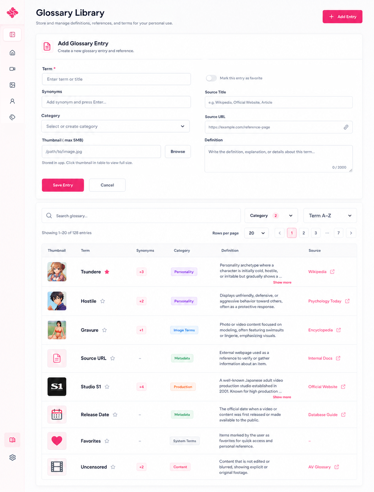

# Glossary Library Page

Code: No
Layout: Yes
Mockup: Yes
Parent item: Glossary Page (Glossary%20Page%20372b4fe015dd803fbf4bec6f6602bedb.md)
Select: In progress

# Glossary Library — Final Layout List

## Header

- **Glossary Library** - Page title - Halaman untuk menyimpan definisi, referensi, dan istilah personal.
- **Subtitle** - Text - `Store and manage definitions, references, and terms for your personal use.`
- **Add Entry** - Primary button - Membuka form Add Glossary Entry.

---

# 1. Glossary Form — Hidden by Default

Fungsi: Membuat, mengedit, atau menghapus glossary entry.

## Visibility

- **Default State** - Hidden - Form tidak tampil saat halaman pertama dibuka.
- **Add State** - Show - Form tampil saat user klik **Add Entry**.
- **Edit State** - Show - Form tampil saat user klik row table.
- **Delete State** - Confirm modal - Delete hanya muncul saat edit entry.

## Form Header

- **Add Glossary Entry** - Title add mode - Membuat entry baru.
- **Edit Glossary Entry** - Title edit mode - Mengubah entry yang dipilih.
- **Helper Text** - Text - `Create a new glossary entry and reference.`

## Fields

- **Term** - Text field, required - Nama istilah utama.
- **Synonyms** - Text/chip input - Sinonim atau nama lain; tekan Enter untuk menambahkan.
- **Category** - Searchable select - Pilih atau buat category glossary.
- **Thumbnail** - Text field + Browse, max 5MB - Thumbnail disimpan di aplikasi.
- **Favorite** - Toggle - Menandai entry sebagai favorit.
- **Source Title** - Text field - Judul/nama referensi.
- **Source URL** - URL field + link icon - Alamat link referensi.
- **Definition** - Text area, required - Definisi lengkap entry.
- **Character Counter** - Auto counter - Contoh `0 / 2000`.

## Actions

- **Save Entry** - Primary button - Simpan entry baru.
- **Update Entry** - Primary button - Simpan perubahan entry.
- **Delete Entry** - Danger button - Hapus entry, hanya di edit mode.
- **Cancel** - Secondary button - Batalkan dan hide form.

## Behavior

- Form hanya muncul saat proses **CRUD** digunakan.
- Klik **Add Entry** → tampilkan form add.
- Klik row table → tampilkan form edit.
- Klik **Cancel** → form collapse/hide.
- Save/Update berhasil → form hide dan table refresh.
- Delete wajib confirmation.
- Thumbnail max 5MB, disimpan di app, bukan link external.
- Source link hanya 1 per entry.

---

# 2. Toolbar

Fungsi: Search, filter, sort, dan pagination glossary.

## Main Toolbar

- **Search Glossary** - Search field - Cari term, synonyms, definition, category, source title, atau source URL.
- **Category** - Multiple select dropdown - Filter category glossary.
- **Category Count Badge** - Badge - Jumlah category filter aktif.
- **Sort** - Dropdown - Term A-Z / Term Z-A / Category A-Z / Category Z-A.

## Pagination Row

- **Showing Count** - Text - Contoh `Showing 1–20 of 128 entries`.
- **Rows per Page** - Dropdown - Jumlah row per halaman.
- **Pagination** - Button group - Previous / page number / next.

## Behavior

- Search update hasil secara langsung.
- Category bisa multiple select.
- Sort hanya berdasarkan Term atau Category.
- Tidak ada card view.
- Tidak ada Last Added / Last Updated.
- Tidak ada Has Link filter.

---

# 3. Glossary Table

Fungsi: Menampilkan glossary entries dalam format table satu baris yang compact.

## Columns

- **Thumbnail** - Mini image/icon - Thumbnail kecil; klik untuk preview full size.
- **Term** - Text + favorite icon - Nama istilah utama.
- **Synonyms** - Count badge - Jumlah sinonim, contoh `+3`.
- **Category** - Badge - Category singkat.
- **Definition** - Text preview - Definisi dengan batas tinggi; jika panjang tampil **Show more**.
- **Source** - Active link - Judul source link + external icon.

## Row Behavior

- Klik row → buka form edit.
- Klik thumbnail → buka preview full size.
- Klik **Show more** → expand definition di row yang sama.
- Klik source → buka external reference.
- Klik favorite icon → toggle favorite.
- Tidak ada action button di row.

---

---

# 4. Footer Notice

- **Glossary Independence Notice** - Info text - `Glossary entries are independent references and do not affect Category Management, catalog filters, metadata, or item relations.`

---

# Final Page Structure

```
Glossary Library
[Add Entry]

<Form hidden by default>
Show only for Add / Edit / Delete flow

Toolbar
[Search glossary...] [Category + count] [Sort: Term A-Z]

Pagination
Showing count | Rows per page | Page buttons

Table
Thumbnail | Term | Synonyms | Category | Definition | Source

Footer Notice
Glossary is independent from catalog/category systems.
```



.png)

.png)

.png)

.png)