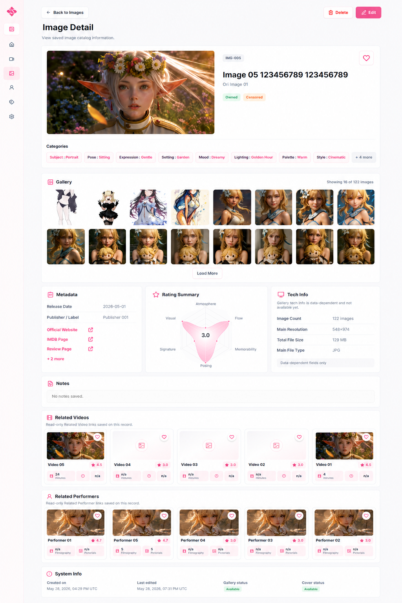

# Image Detail section order

Code: No
Layout: Yes
Mockup: Yes
Parent item: Final Detail Spec (Final%20Detail%20Spec%20370b4fe015dd807c80d8e37b0b809cac.md)
Select: In progress

# Image Detail Layout

## 1. Header

- **Back to Images** - Button - Kembali ke halaman Images.
- **Image Detail** - Page title - Menampilkan detail image set/gallery.
- **Subtitle** - Text - `View saved image catalog information.`
- **Delete** - Button - Hapus image record.
- **Edit** - Button - Masuk ke Image Form edit mode.

## 2. Hero Summary

- **Cover Image** - Large image - Cover utama image/gallery.
- **Image Code** - Badge - Kode image, contoh `IMG-005`.
- **Title** - Heading - Judul utama image.
- **Original Title** - Text - Judul asli.
- **Availability** - Badge - Status file: Owned / Not Owned / Missing.
- **Censorship** - Badge - Status sensor jika ada.
- **Favorite** - Icon button - Tandai image favorit.

## 3. Gallery

- **Gallery** - Section card - Menampilkan preview image files.
- **Image Grid** - Compact grid - Thumbnail image yang tersimpan.
- **Image Count** - Text - Contoh `Showing 16 of 122 images`.
- **Load More** - Button - Menampilkan image berikutnya.

## 4. Categories

- **Categories** - Section card - Menampilkan category sebagai chips.
- **Category Chip** - Chip - Format `Parent Child`, contoh:
    - `Face Cute`
    - `Body Petite`
    - `Pose Sitting`
    - `Setting Beach`
- **More Categories** - Button chip - Contoh `+8 more`.

## 5. Metadata

- **Release Date** - Text - Tanggal rilis/publikasi.
- **Publisher / Label** - Text - Publisher, studio, atau label.
- **Links** - Active link list - Link sumber menggunakan title.
- **More Links** - Inline link - Contoh `+2 more`.

## 6. Rating Summary

- **Rating Summary** - Card - Ringkasan rating image.
- **Radar / Spider Chart** - Chart - Visualisasi rating.
- **Average Rating** - Center score - Total/rata-rata rating di tengah chart.
- **Rating Axis** - Chart label - Memorability, Visual, Posing, Atmosphere, Flow, Signature.

## 7. Tech Info

- **Image Count** - Text - Jumlah image.
- **Main Resolution** - Text - Resolusi utama.
- **Total File Size** - Text - Total ukuran file.
- **Main File Type** - Text - Format file utama.

## 8. Notes

- **Notes** - Section card - Catatan image.
- **Empty State** - Text - `No notes saved.`

## 9. Related Videos

- **Related Videos** - Section card - Daftar video yang terhubung.
- **Video Card** - Content card - Card video existing, format tidak diubah.
- **Favorite Icon** - Icon - Status favorit video.
- **Rating Badge** - Badge - Rating video.
- **Stats** - Mini info - Durasi, image count, atau info terkait.

## 10. Related Performers

- **Related Performers** - Section card - Daftar performer yang terhubung.
- **Performer Card** - Content card - Card performer existing, format tidak diubah.
- **Favorite Icon** - Icon - Status favorit performer.
- **Rating Badge** - Badge - Rating performer.
- **Stats** - Mini info - Filmography dan pictorials.

## 11. System Info

- **Created On** - Text - Tanggal dan waktu data dibuat.
- **Last Edited** - Text - Tanggal dan waktu terakhir diedit.
- **Gallery Status** - Badge - Status gallery: Available / Missing.
- **Cover Status** - Badge - Status cover: Available / Missing.

