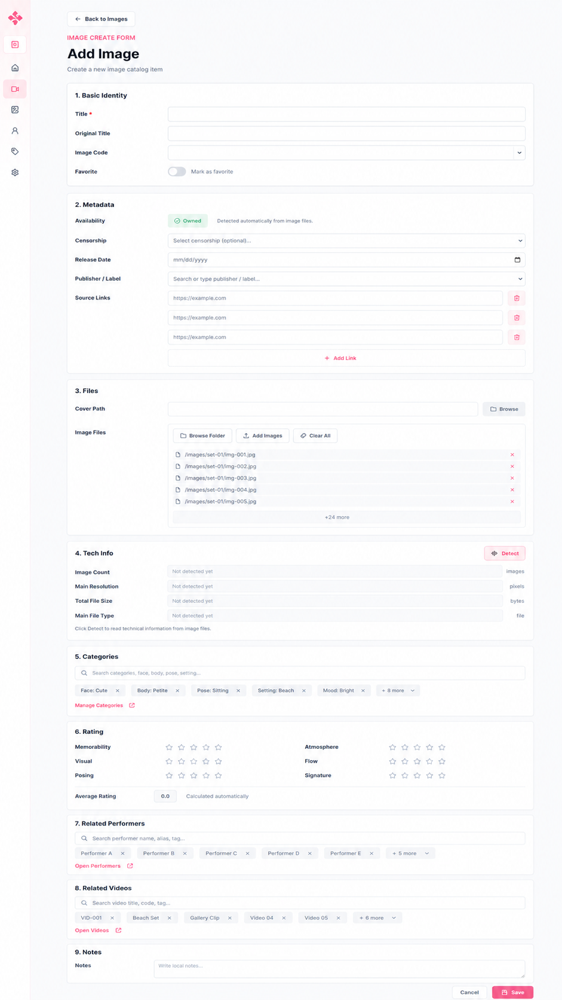

# Image form final

Code: No
Layout: Yes
Mockup: Yes
Parent item: Final Form Spec (Final%20Form%20Spec%20370b4fe015dd80d08428c8e78f957e47.md)
Select: In progress

# Image Form

## 1. Basic Identity

- **Title** - Text field, required - Judul utama image.
- **Original Title** - Text field - Judul asli.
- **Image Code** - Text field + recent values - Kode/serial image.
- **Favorite** - Toggle / checkbox - Tandai favorit.

## 2. Metadata

- **Availability** - Auto badge - Owned / Not Owned / Missing dari image paths.
- **Censorship** - Dropdown, optional - Sensor jika relevan.
- **Release Date** - Date picker - Tanggal rilis/publikasi.
- **Publisher / Label** - Searchable text field + recent values - Publisher/studio/label.
- **Source Links** - Repeatable URL field - `[URL field] [Delete]` + `[+ Add Link]`.

## 3. Files

- **Cover Path** - Text field + browse - Cover utama.
- **Image Files** - Multi path picker - Banyak path image.
- **Browse Folder** - Button - Pilih folder.
- **Add Images** - Button - Tambah file manual.
- **Clear All** - Button - Hapus semua path.
- **Selected Paths** - Compact list max 5 - Sisanya `+X more`.

## 4. Tech Info

- **Detect** - Button - Ambil data dari image files.
- **Image Count** - Auto field - Jumlah image.
- **Main Resolution** - Auto field - Resolusi utama.
- **Total File Size** - Auto field - Total ukuran.
- **Main File Type** - Auto field - Format utama.

## 5. Categories

- **Search Categories** - Smart picker - Cari face, body, pose, setting.
- **Selected Categories** - Chips max 5 - Sisanya `+X more`.
- **More Popover** - Grouped list - Urut berdasarkan parent.
- **Manage Categories** - Shortcut link - Buka category management.

## 6. Rating

- **Memorability** - Rating 1–5 - Default kosong.
- **Visual** - Rating 1–5 - Default kosong.
- **Posing** - Rating 1–5 - Default kosong.
- **Atmosphere** - Rating 1–5 - Default kosong.
- **Flow** - Rating 1–5 - Default kosong.
- **Signature** - Rating 1–5 - Default kosong.
- **Average Rating** - Auto field - Rata-rata decimal.

## 7. Related Performers

- **Search Performers** - Smart picker - Cari nama, alias, tag.
- **Selected Performers** - Chips max 5 - Sisanya `+X more`.
- **Open Performers** - Shortcut link - Buka performers.

## 8. Related Videos

- **Search Videos** - Smart picker - Cari title, code, tag.
- **Selected Videos** - Chips max 5 - Sisanya `+X more`.
- **Open Videos** - Shortcut link - Buka videos.

## 9. Notes

- **Notes** - Text area - Catatan bebas.

