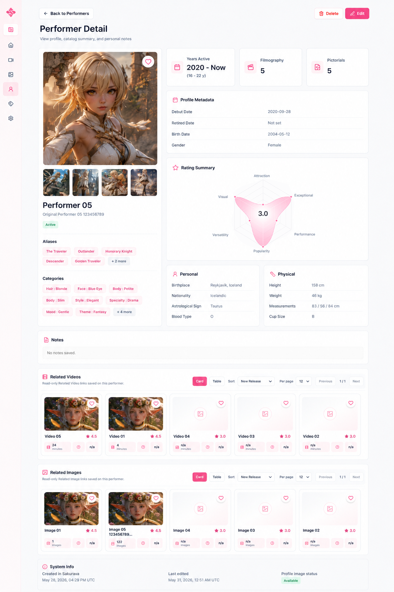

# Performer Detail section order

Code: No
Layout: Yes
Mockup: Yes
Parent item: Final Detail Spec (Final%20Detail%20Spec%20370b4fe015dd807c80d8e37b0b809cac.md)
Select: In progress

# Performer Detail Layout

## 1. Header

- **Back to Performers** - Button - Kembali ke halaman Performers.
- **Performer Detail** - Page title - Menampilkan detail performer.
- **Subtitle** - Text - `View saved performer profile information.`
- **Delete** - Button - Hapus performer.
- **Edit** - Button - Masuk ke Performer Form edit mode.

## 2. Hero Summary

- **Cover Image** - Large image - Cover utama performer.
- **Thumbnail Strip** - Small thumbnails - Thumbnail tambahan 1–4.
- **Name** - Heading - Nama utama performer.
- **Original Name** - Text - Nama asli/lokal.
- **Status** - Badge - Active / Retired / Unknown.
- **Favorite** - Icon button - Tandai performer favorit.
- **Aliases** - Chips - Alias performer, max compact.
- **More Aliases** - Button chip - Contoh `+3 more`.

## 3. Categories

- **Categories** - Section card - Menampilkan category performer sebagai chips.
- **Category Chip** - Chip - Format `Parent Child`, contoh:
    - `Face Cute`
    - `Body Petite`
    - `Hair Blonde`
    - `Specialty Drama`
- **More Categories** - Button chip - Contoh `+12 more`.

## 4. Activity Summary

- **Years Active** - Stat card - Durasi aktif berdasarkan debut/retired date.
- **Filmography** - Stat card - Jumlah related videos.
- **Pictorials** - Stat card - Jumlah related images.

## 5. Profile Metadata

- **Gender** - Text - Female / Male / Other / Unknown.
- **Debut Date** - Text - Tanggal debut.
- **Retired Date** - Text - Tanggal retired jika ada.
- **Birth Date** - Text - Tanggal lahir.

## 6. Rating Summary

- **Rating Summary** - Card - Ringkasan rating performer.
- **Radar / Spider Chart** - Chart - Visualisasi rating.
- **Average Rating** - Center score - Total/rata-rata rating di tengah chart.
- **Rating Axis** - Chart label - Attraction, Visual, Performance, Popularity, Exceptional, Versatility.

## 7. Profile Details

- **Birthplace** - Text - Tempat lahir.
- **Nationality** - Text - Negara/kewarganegaraan.
- **Astrological Sign** - Text - Otomatis dari birth date.
- **Blood Type** - Text - Golongan darah.
- **Height** - Text - Tinggi badan.
- **Weight** - Text - Berat badan.
- **Measurements** - Text - Ukuran tubuh.
- **Cup Size** - Text - Ukuran cup.
- **Links** - Active link list - Link profil/sumber menggunakan title.
- **More Links** - Inline link - Contoh `+2 more`.

## 8. Notes

- **Notes** - Section card - Catatan performer.
- **Empty State** - Text - `No notes saved.`

## 9. Related Videos

- **Related Videos** - Section card - Daftar video yang terhubung.
- **Video Card** - Content card - Card video existing, format tidak diubah.

## 10. Related Images

- **Related Images** - Section card - Daftar image yang terhubung.
- **Image Card** - Content card - Card image existing, format tidak diubah.

## 11. System Info

- **Created On** - Text - Tanggal dan waktu data dibuat.
- **Last Edited** - Text - Tanggal dan waktu terakhir diedit.
- **Profile Image Status** - Badge - Status cover/profile image.
- **Thumbnail Status** - Badge - Status thumbnails.

