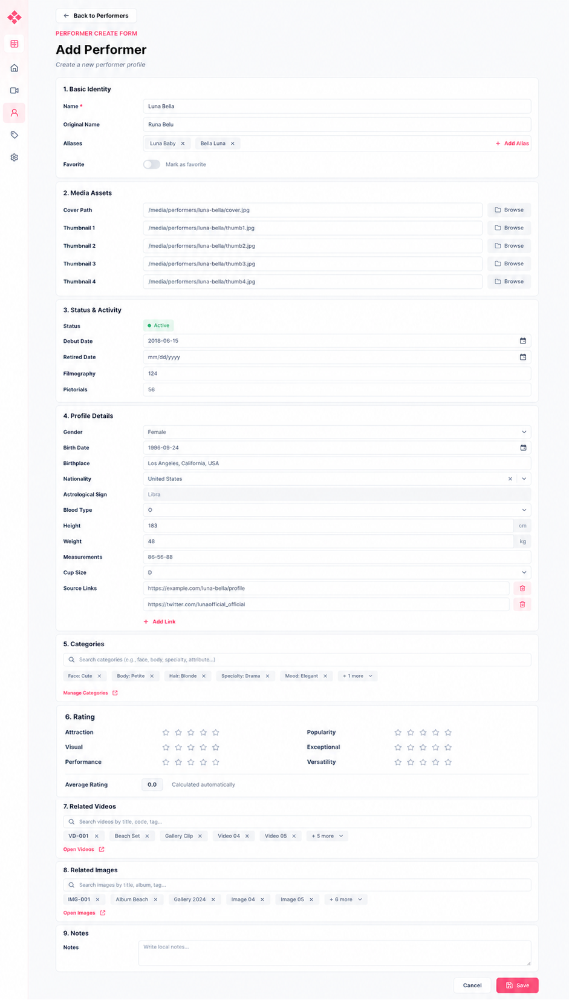

# Performer form final

Code: No
Layout: Yes
Mockup: Yes
Parent item: Final Form Spec (Final%20Form%20Spec%20370b4fe015dd80d08428c8e78f957e47.md)
Select: In progress

# Performer Form

## 1. Basic Identity

- **Name** - Text field, required - Nama utama performer.
- **Original Name** - Text field - Nama asli/lokal.
- **Aliases** - Repeatable text field + recent values - Nama lain.
- **Favorite** - Toggle / checkbox - Tandai favorit.

## 2. Media Assets

- **Cover Path** - Text field + browse - Cover utama.
- **Thumbnail 1–4** - Text field + browse - Thumbnail opsional.

## 3. Status & Activity

- **Status** - Auto badge - Active / Retired / Unknown.
- **Debut Date** - Date picker - Tanggal mulai aktif.
- **Retired Date** - Date picker - Tanggal berhenti aktif.
- **Filmography** - Auto count - Jumlah related videos.
- **Pictorials** - Auto count - Jumlah related images.

## 4. Profile Details

- **Gender** - Dropdown - Female / Male / Other / Unknown.
- **Birth Date** - Date picker - Tanggal lahir.
- **Birthplace** - Text field + recent values - Tempat lahir.
- **Nationality** - Searchable text field + recent values - Negara/kewarganegaraan.
- **Astrological Sign** - Auto field - Dari birth date.
- **Blood Type** - Dropdown / recent values - Golongan darah.
- **Height** - Number field - cm.
- **Weight** - Number field - kg.
- **Measurements** - Text field + recent values - Ukuran tubuh.
- **Cup Size** - Text field/dropdown + recent values - Ukuran cup.
- **Source Links** - Repeatable URL field - `[URL field] [Delete]` + `[+ Add Link]`.

## 5. Categories

- **Search Categories** - Smart picker - Cari face, body, specialty, attribute.
- **Selected Categories** - Chips max 5 - Sisanya `+X more`.
- **More Popover** - Grouped list - Urut berdasarkan parent.
- **Manage Categories** - Shortcut link - Buka category management.

## 6. Rating

- **Attraction** - Rating 1–5 - Default kosong.
- **Visual** - Rating 1–5 - Default kosong.
- **Performance** - Rating 1–5 - Default kosong.
- **Popularity** - Rating 1–5 - Default kosong.
- **Exceptional** - Rating 1–5 - Default kosong.
- **Versatility** - Rating 1–5 - Default kosong.
- **Average Rating** - Auto field - Rata-rata decimal.

## 7. Related Videos

- **Search Videos** - Smart picker - Cari title, code, tag.
- **Selected Videos** - Chips max 5 - Sisanya `+X more`.
- **Open Videos** - Shortcut link - Buka videos.

## 8. Related Images

- **Search Images** - Smart picker - Cari title, album, tag.
- **Selected Images** - Chips max 5 - Sisanya `+X more`.
- **Open Images** - Shortcut link - Buka images.

## 9. Notes

- **Notes** - Text area - Catatan bebas.

