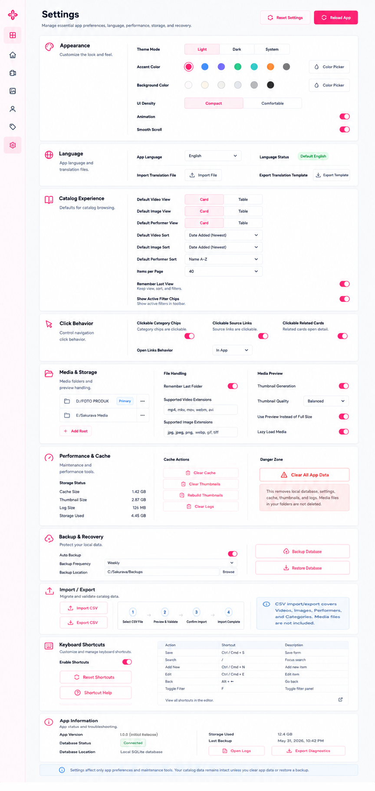
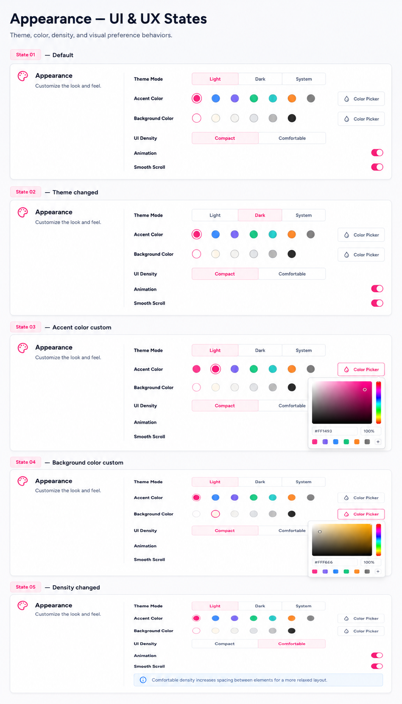
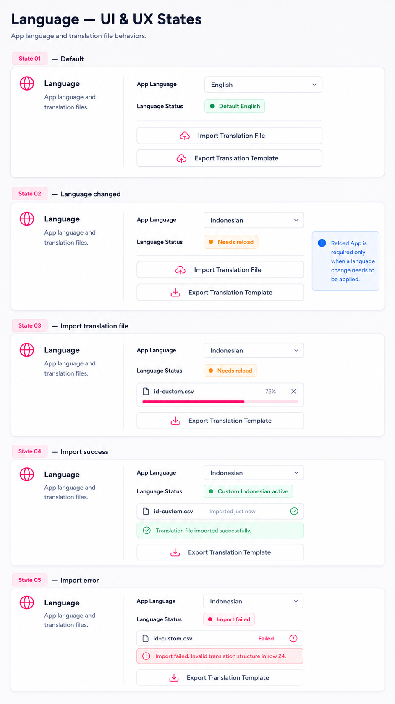
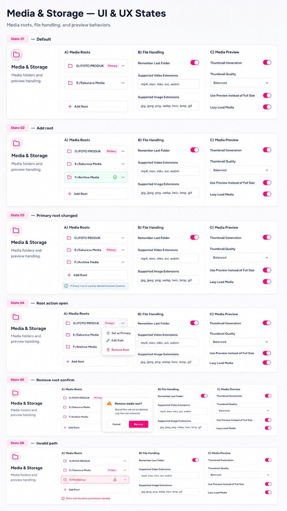
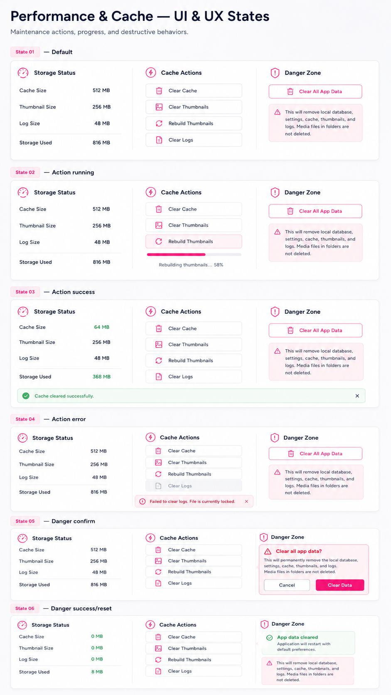
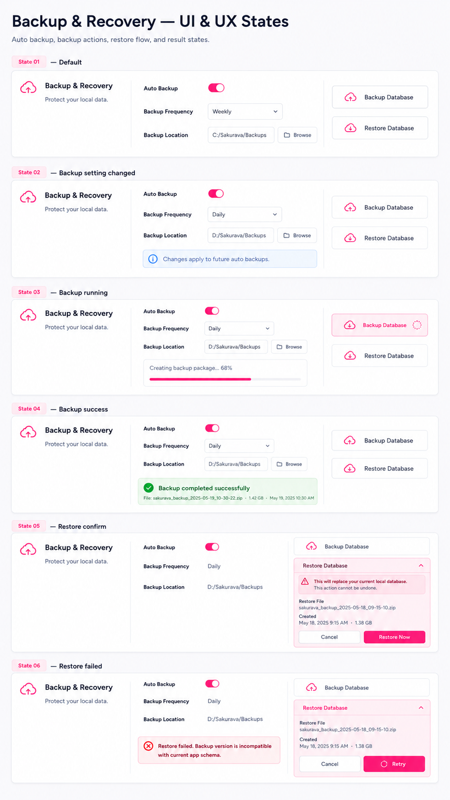
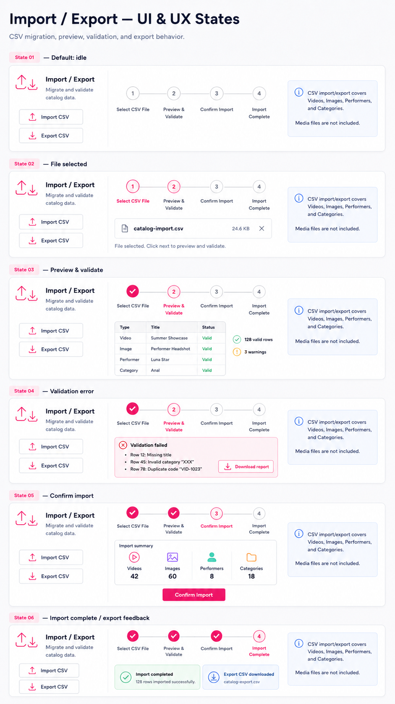
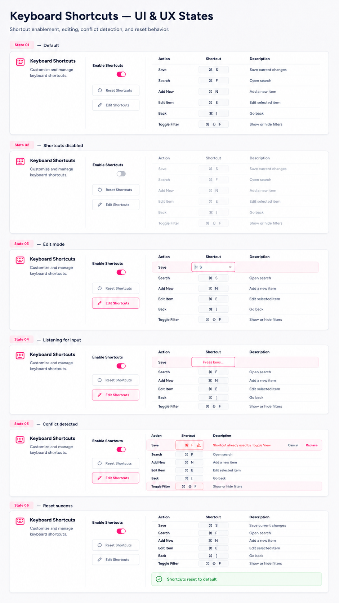

# Section layout

Code: No
Layout: Yes
Mockup: Yes
Parent item: Final Settings Spec (Final%20Settings%20Spec%20370b4fe015dd80b984c5f46c0e04dd8a.md)
Select: Not started

# Settings Page — Final Layout for Notion

## Header

- **Settings** - Page title - Mengatur preferensi aplikasi, bahasa, tampilan, storage, backup, dan maintenance.
- **Reset Settings** - Button - Reset semua pengaturan non-database ke default.
- **Reload App** - Button - Reload/restart app untuk menerapkan setting tertentu.

Behavior:

- **Reset Settings** tidak menghapus database, media, category, item, rating, relation, atau backup.
- **Reload App** hanya muncul/aktif jika ada perubahan yang butuh reload.
- Semua perubahan ringan langsung diterapkan otomatis.

---

# 1. Appearance

Fungsi: Mengatur tampilan visual utama aplikasi.

## Theme

- **Theme Mode** - Segmented control - Light / Dark / System.

## Color

- **Accent Color** - Color picker + 5 preset - Warna utama UI.
    - Sakura Pink - Default
    - Sky Blue
    - Lavender
    - Mint Green
    - Sunset Orange
- **Background Color** - Color picker + 5 preset - Warna background aplikasi.
    - Snow White - Default
    - Soft Gray
    - Warm Cream
    - Cool Blue Gray
    - Dark Charcoal

## Layout

- **UI Density** - Segmented control - Compact / Comfortable.
- **Animation** - Toggle - Mengaktifkan/mematikan animasi UI.
- **Smooth Scroll** - Toggle - Mengaktifkan/mematikan scroll halus.

Behavior:

- Color picker mendukung color wheel, HEX, dan RGB.
- Preset color bisa dipilih cepat.
- Accent/background langsung preview.
- Animation Off mengurangi transisi, hover animation, dan panel motion.
- Compact adalah default utama.

---

# 2. Language

Fungsi: Mengatur bahasa aplikasi dan file terjemahan.

- **App Language** - Dropdown - Bahasa aplikasi aktif.
    - English
    - Custom Language
- **Language Status** - Badge - Status bahasa.
    - Default English
    - Custom Loaded
    - Need Reload
- **Import Translation File CSV** - Button - Import file bahasa custom
- **Export Translation Template CSV** - Button - Export template bahasa CSV untuk diedit.

Behavior:

- Default saat ini adalah English only.
- Mendukung semua format tanggal.
- Setelah import translation file, status berubah menjadi Custom Loaded.
- Jika perubahan bahasa butuh apply ulang, tampilkan status Need Reload dan aktifkan **Reload App** di header.

---

# 3. Catalog Experience

Fungsi: Mengatur default halaman catalog/collection.

## Default View

- **Default Video View** - Segmented control - Card / Table.
- **Default Image View** - Segmented control - Card / Table.
- **Default Performer View** - Segmented control - Card / Table.

## Default Sorting

- **Default Video Sort** - Dropdown - Last Added, Last Updated, Title A-Z, Release Date, Rating, Duration.
- **Default Image Sort** - Dropdown - Last Added, Last Updated, Title A-Z, Release Date, Rating, Image Count.
- **Default Performer Sort** - Dropdown - Last Added, Last Updated, Name A-Z, Debut Date, Rating, Filmography, Pictorials.

## Display

- **Items per Page** - Dropdown - 20 / 40 / 80 / 120.
- **Remember Last View** - Toggle - Simpan view, sort, dan filter terakhir per catalog.
- **Show Active Filter Chips** - Toggle - Tampilkan chip filter aktif di toolbar.

Behavior:

- Jika Remember Last View aktif, app mengikuti state terakhir user.
- Jika nonaktif, app memakai default view/sort dari Settings.
- Search/filter/sort tetap otomatis dan tidak perlu setting tambahan.

---

# 4. Click Behavior

Fungsi: Mengatur apakah elemen detail bisa menjadi navigasi cepat.

- **Clickable Category Chips** - Toggle - Category chip bisa diklik untuk membuka catalog dengan filter terkait.
- **Clickable Source Links** - Toggle - Source link aktif/nonaktif.
- **Clickable Related Cards** - Toggle - Related card bisa membuka detail item terkait.
- **Open External Link** - On / Off.

Behavior:

- Category chip dari detail page membuka catalog terkait dengan filter category aktif.
- Source link membuka halaman sumber External Browser.
- Related card membuka detail item terkait.
- Back behavior selalu kembali ke halaman sebelumnya dan posisi terakhir sebagai default app behavior.

---

# 5. Media & Storage

Fungsi: Mengatur folder media, preview, thumbnail, dan format file.

## Media Roots

- **Media Root Item** - Path row - Folder media yang terdaftar.
- **Primary Badge** - Badge - Menandai root utama.
- **More Action** - Icon button - Opsi tambahan untuk root.
- **Add Root** - Button - Menambahkan folder media baru.

## File Handling

- **Remember Last Folder** - Toggle - Browse file dimulai dari folder terakhir.
- **Supported Video Extensions** - Editable text/list - Contoh: mp4, mkv, mov, webm, avi.
- **Supported Image Extensions** - Editable text/list - Contoh: jpg, jpeg, png, webp, gif, tiff.

## Media Preview

- **Thumbnail Generation** - Toggle - Generate thumbnail otomatis.
- **Thumbnail Quality** - Dropdown - Low / Balanced / High.
- **Use Preview Instead of Full Size** - Toggle - Card/detail memakai preview, bukan file full size.
- **Lazy Load Media** - Toggle - Load media saat dibutuhkan.

Behavior:

- App tidak menampilkan full-size media kecuali dibutuhkan.
- Thumbnail tersimpan di app, bukan mengganti file asli.
- Mirip WordPress image size: thumbnail / preview / full.
- Media asli tetap berada di folder user.

---

# 6. Performance & Cache

Fungsi: Membersihkan cache, thumbnail, log, dan data aplikasi.

## Storage Status

- **Cache Size** - Info - Ukuran cache sementara.
- **Thumbnail Size** - Info - Ukuran generated thumbnails.
- **Log Size** - Info - Ukuran log aplikasi.
- **Storage Used** - Info - Total storage aplikasi.

## Cache Actions

- **Clear Cache** - Button - Menghapus cache sementara.
- **Clear Thumbnails** - Button - Menghapus generated thumbnails.
- **Rebuild Thumbnails** - Button - Generate ulang thumbnails.
- **Clear Logs** - Button - Menghapus log aplikasi.

## Danger Zone

- **Clear All App Data** - Danger button - Menghapus semua data aplikasi lokal dan kembali seperti fresh install.
- **Danger Notice** - Warning text - Media files di folder user tidak ikut terhapus.

Behavior:

- Clear Cache tidak menghapus database atau media asli.
- Clear Thumbnails tidak menghapus media asli.
- Rebuild Thumbnails membuat ulang thumbnail dari media path yang tersedia.
- Clear Logs hanya menghapus file log.
- Clear All App Data menghapus database lokal, settings, cache, thumbnails, dan logs.
- Clear All App Data wajib memakai konfirmasi kuat.

---

# 7. Backup & Recovery

Fungsi: Backup dan restore database lokal.

## Auto Backup

- **Auto Backup** - Toggle - Backup otomatis aktif/nonaktif.
- **Backup Frequency** - Dropdown - Daily / Weekly / Monthly.
- **Backup Location** - Path field + Browse - Folder lokasi backup.

## Manual Backup

- **Backup Database** - Button - Membuat file backup SQLite.
- **Restore Database** - Button - Restore database dari file SQLite.

Behavior:

- Backup/restore menggunakan file SQLite/database backup.
- Backup database tidak menyertakan media asli.
- Restore wajib menampilkan warning karena akan mengganti database aktif.
- Retention backup tidak perlu tampil di UI; gunakan default system.

---

# 8. Import / Export

Fungsi: Import dan export data catalog dalam format CSV.

- **Import CSV** - Button - Import data Videos, Images, Performers, Categories.
- **Export CSV** - Button - Export data catalog ke CSV.

Behavior:

- Import/export CSV berbeda dari backup/restore database.
- Import CSV membuka flow:
    - Select CSV file
    - Preview & Validate
    - Confirm Import
    - Import Complete
- Preview & Validate adalah step otomatis, bukan toggle.
- Export CSV hanya export data table, bukan media asli.
- Validation menampilkan error, duplicate, missing relation, dan format tidak valid.

---

# 9. Keyboard Shortcuts

Fungsi: Mengatur shortcut dasar aplikasi.

- **Enable Shortcuts** - Toggle - Shortcut aktif/nonaktif.
- **Edit Shortcuts** - Button - Membuka editor shortcut.
- **Reset Shortcuts** - Button - Mengembalikan shortcut ke default.

## Default Shortcut Behavior

- **Save — Ctrl/Cmd + S**
Aktif hanya di form Add/Edit jika ada perubahan.
- **Close / Cancel — Esc**
Aktif saat modal, dropdown, filter panel, popover, atau edit shortcut terbuka.
- **Focus Search — /**
Aktif di catalog page. Tidak aktif saat sedang mengetik di input/text area.
- **Add New — Ctrl/Cmd + N**
Aktif di catalog page. Membuka form sesuai halaman aktif.
- **Edit Item — Ctrl/Cmd + E**
Aktif di detail page. Membuka form edit item tersebut.
- **Back — Alt + ←**
Aktif jika ada history halaman sebelumnya.
- **Forward — Alt + →**
Aktif jika ada forward history.
- **Toggle Filter — F**
Aktif hanya di catalog page. Tidak aktif saat sedang mengetik.
- **Toggle View — V**
Aktif hanya di catalog page. Tidak aktif saat sedang mengetik.

## Rule Global

- Shortcut tidak berjalan saat fokus ada di text field, textarea, search field, atau editable table.
- Shortcut tidak berjalan jika modal konfirmasi sedang aktif, kecuali **Esc**.
- Jika shortcut bentrok dengan browser/system, app harus memberi warning saat user edit key.

Behavior:

- Klik shortcut row untuk edit key.
- Saat edit, user cukup tekan kombinasi key baru.
- Jika shortcut bentrok, tampilkan warning.
- User hanya bisa mengganti key, bukan menambah action baru.
- Shortcut Help tidak diperlukan karena daftar shortcut sudah tampil langsung.

---

# 10. Extensions

Fungsi: Menyiapkan ruang untuk extension/plugin di versi setelah 1.0.0.

- **Extension System** - Status card - Coming Soon.
- **Extension Status** - Badge - Planned.
- **Extension Manager** - Disabled button - Belum tersedia di versi ini.

Behavior:

- Di versi sekarang hanya visual/status.
- Tidak ada install, enable, disable, atau marketplace.
- Extension nanti bisa masuk ke section yang relevan, bukan selalu membuat section baru.
- Contoh extension masa depan tidak perlu ditampilkan di UI sekarang.

Contoh layout:

```
10. Extensions

Extension System
Plugin and extension support is planned for a future version.

Status: Coming Soon
[Manage Extensions - Disabled]
```

---

# 11. App Information

Fungsi: Informasi aplikasi, database, storage, dan troubleshooting ringan.

## App Status

- **App Version** - Text - Versi aplikasi (1.0.0 - initial release).
- **Database Status** - Badge - Connected / Error.
- **Database Location** - Text/path - Lokasi database lokal.
- **Storage Used** - Text - Total storage digunakan.
- **Last Backup** - Text - Waktu backup terakhir.

## Diagnostics

- **Open Logs** - Button - Membuka file/folder log aplikasi.
- **Export Diagnostics** - Button - Export data troubleshooting.

Behavior:

- Section paling bawah.
- Tidak untuk pengaturan harian.
- Fokus membantu troubleshooting.

---

# Default UX, Tidak Perlu Jadi Setting

Fitur berikut sebaiknya jadi behavior bawaan aplikasi:

- **Tech info behavior** - Auto detect dan read-only logic berjalan natural.
- **Navigation history behavior** - Back kembali ke halaman sebelumnya.
- **Restore scroll on back** - Back restore posisi scroll terakhir.
- **Scroll to top on new navigation** - Menu/primary navigation mulai dari top.
- **Recent values behavior** - Suggestion value aktif sebagai UX default.
- **Rating calculation** - Average rating otomatis.
- **Safety validation** - Validate before save otomatis.
- **Warn duplicate code** - Warning otomatis.
- **Warn missing media** - Warning otomatis.
- **Block delete used category** - Protection otomatis.

---

# Final Section Order

```
Header
1. Appearance
2. Language
3. Catalog Experience
4. Click Behavior
5. Media & Storage
6. Performance & Cache
7. Backup & Recovery
8. Import / Export
9. Keyboard Shortcuts
10. Extensions
11. App Information
```















