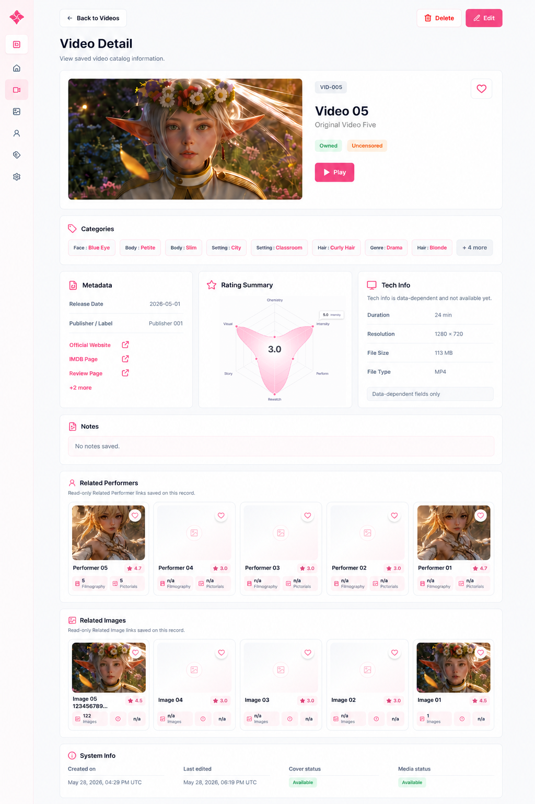

# Video Detail section order

Code: No
Layout: Yes
Mockup: Yes
Parent item: Final Detail Spec (Final%20Detail%20Spec%20370b4fe015dd807c80d8e37b0b809cac.md)
Select: In progress

# Video Detail Layout

## 1. Header

- **Back to Videos** - Button - Kembali ke halaman Videos.
- **Video Detail** - Page title - Menampilkan detail video yang sudah tersimpan.
- **Subtitle** - Text - `View saved video catalog information.`
- **Delete** - Button - Hapus video.
- **Edit** - Button - Masuk ke Video Form edit mode.

## 2. Hero Summary

- **Cover Image** - Large image - Cover utama video.
- **Video Code** - Badge - Kode video, contoh `VID-005`.
- **Title** - Heading - Judul utama video.
- **Original Title** - Text - Judul asli video.
- **Availability** - Badge - Status file: Owned / Not Owned / Missing.
- **Censorship** - Badge - Status sensor: Censored / Uncensored / Reduced Mosaic / Leaked.
- **Favorite** - Icon button - Tandai video favorit.
- **Play** - Primary button - Membuka media video di player.

## 3. Categories

- **Categories** - Section card - Menampilkan category video sebagai chips.
- **Category Chip** - Chip - Format `Parent Child`, contoh:
    - `Face Blue Eye`
    - `Body Petite`
    - `Setting City`
    - `Genre Drama`
- **More Categories** - Button chip - Menampilkan sisa category, contoh `+4 more`.

## 4. Metadata

- **Release Date** - Text - Tanggal rilis video.
- **Publisher / Label** - Text - Publisher, studio, atau label.
- **Links** - Active link list - Link sumber menggunakan title, bukan URL mentah.
    - **Official Website** - Active link - Membuka halaman sumber.
    - **IMDB Page** - Active link - Membuka database/reference.
    - **Review Page** - Active link - Membuka halaman review.
    - **More Links** - Inline link - Contoh `+2 more`.

## 5. Rating Summary

- **Rating Summary** - Card - Ringkasan rating video.
- **Radar / Spider Chart** - Chart - Visualisasi rating.
- **Average Rating** - Center score - Total/rata-rata rating di tengah chart.
- **Rating Axis** - Chart label - Rewatch, Performance, Visual, Intensity, Story, Chemistry.

## 6. Tech Info

- **Duration** - Text - Durasi video.
- **Resolution** - Text - Resolusi video.
- **File Size** - Text - Ukuran file.
- **File Type** - Text - Format file.

## 7. Related Performers

- **Related Performers** - Section card - Daftar performer yang terhubung.
- **Performer Card** - Content card - Card performer existing, format tidak diubah.
- **Favorite Icon** - Icon - Status favorit performer.
- **Rating Badge** - Badge - Rating performer.
- **Stats** - Mini info - Filmography dan pictorials.

## 8. Related Images

- **Related Images** - Section card - Daftar image/album yang terhubung.
- **Image Card** - Content card - Card image existing, format tidak diubah.
- **Favorite Icon** - Icon - Status favorit image.
- **Rating Badge** - Badge - Rating image.
- **Stats** - Mini info - Jumlah images atau info terkait.

## 9. System Info

- **Created On** - Text - Tanggal dan waktu data dibuat.
- **Last Edited** - Text - Tanggal dan waktu terakhir diedit.
- **Cover Status** - Badge - Status cover: Available / Missing.
- **Media Status** - Badge - Status media: Available / Missing.

