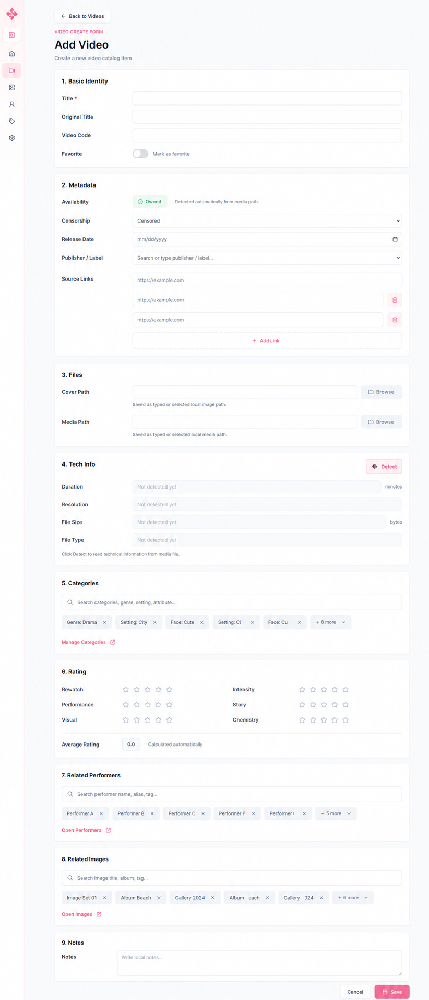

# Video form final

Code: No
Layout: Yes
Mockup: Yes
Parent item: Final Form Spec (Final%20Form%20Spec%20370b4fe015dd80d08428c8e78f957e47.md)
Select: In progress

# Video Form

## 1. Basic Identity

- **Title** - Text field, required - Judul utama video.
- **Original Title** - Text field - Judul asli.
- **Video Code** - Text field + recent values - Kode/serial video.
- **Favorite** - Toggle / checkbox - Tandai favorit.

## 2. Metadata

- **Availability** - Auto badge - Owned / Not Owned / Missing dari media path.
- **Censorship** - Dropdown - Censored / Uncensored / Reduced Mosaic / Leaked.
- **Release Date** - Date picker - Tanggal rilis.
- **Publisher / Label** - Searchable text field + recent values - Publisher/studio/label.
- **Source Links** - Repeatable URL field - `[URL field] [Delete]` + `[+ Add Link]`.

## 3. Files

- **Cover Path** - Text field + browse - Lokasi cover.
- **Media Path** - Text field + browse - Lokasi video utama.

## 4. Tech Info

- **Detect** - Button - Ambil data dari media path.
- **Duration** - Auto field - Durasi video.
- **Resolution** - Auto field - Resolusi.
- **File Size** - Auto field - Ukuran file.
- **File Type** - Auto field - Format file.

## 5. Categories

- **Search Categories** - Smart picker - Cari genre, setting, attribute.
- **Selected Categories** - Chips max 5 - Sisanya `+X more`.
- **More Popover** - Grouped list - Urut berdasarkan parent: Genre, Setting, Face, Body, etc.
- **Manage Categories** - Shortcut link - Buka category management.

## 6. Rating

- **Rewatch** - Rating 1–5 - Default kosong.
- **Performance** - Rating 1–5 - Default kosong.
- **Visual** - Rating 1–5 - Default kosong.
- **Intensity** - Rating 1–5 - Default kosong.
- **Story** - Rating 1–5 - Default kosong.
- **Chemistry** - Rating 1–5 - Default kosong.
- **Average Rating** - Auto field - Rata-rata decimal.

## 7. Related Performers

- **Search Performers** - Smart picker - Cari nama, alias, tag.
- **Selected Performers** - Chips max 5 - Sisanya `+X more`.
- **Open Performers** - Shortcut link - Buka performers.

## 8. Related Images

- **Search Images** - Smart picker - Cari title, album, tag.
- **Selected Images** - Chips max 5 - Sisanya `+X more`.
- **Open Images** - Shortcut link - Buka images.

## 9. Notes

- **Notes** - Text area - Catatan bebas.

